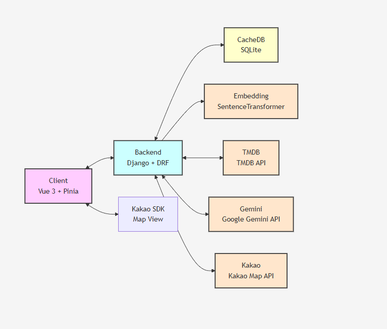
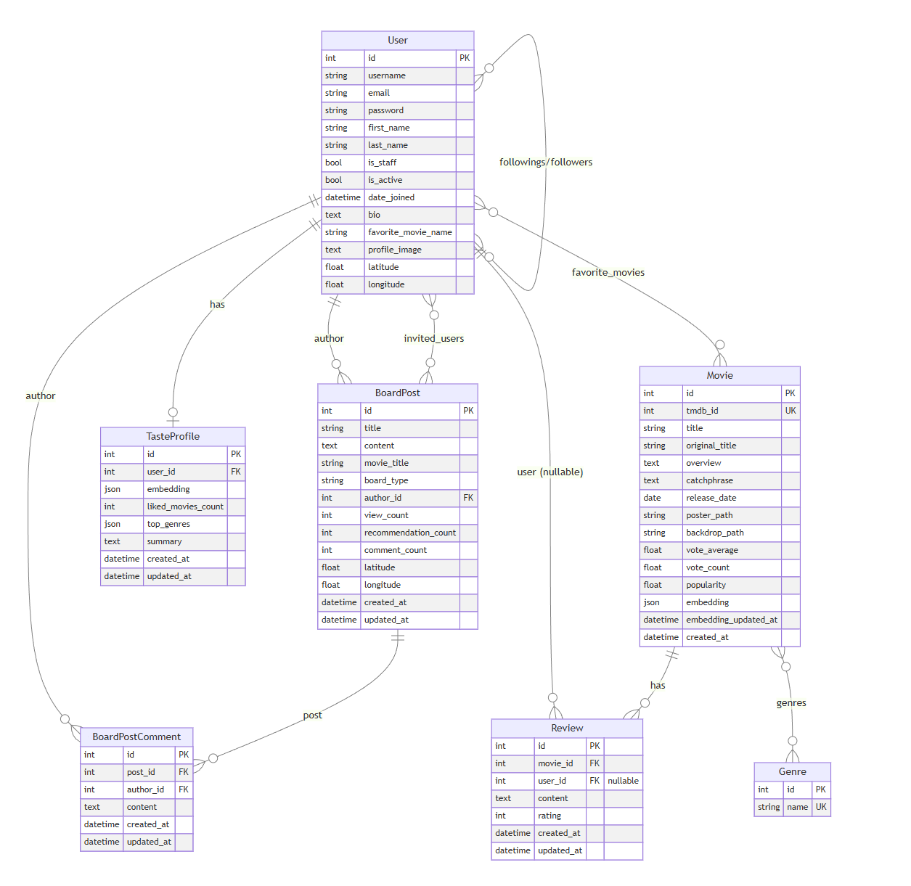

# 🎬 MovieMate (무비메이트)

> "영화를 보고, 나누고, 나만의 취향을 연결하다 🤝 MovieMate가 제안하는 당신의 인생 영화 파트너"

---

## 🔗 프로젝트 개요

### 🌐 서비스 소개
MovieMate는 TMDB, Kakao Map, 생성형 AI(Gemini)를 결합하여 영화 탐색부터 개인 맞춤형 추천, 주변 극장 찾기, 커뮤니티 활동까지 한 번에 경험할 수 있는 모던 웹 애플리케이션입니다.

- **진행 기간**: 2025.12.19 ~ 2025.12.25
- **핵심 목표**: 영화의 추천 → 평가 → 취향 기반 사용자 연결

---

## 🚀 시작하기 (Local Setup)

### 1️⃣ Backend (Django)
```bash
cd backend
# .env 파일에 TMDB_API_KEY, GEMINI_API_KEY 설정 필요
python -m venv venv
source venv/Scripts/activate 
pip install -r requirements.txt
python manage.py migrate
python manage.py runserver
```

### 2️⃣ Frontend (Vue.js)
```bash
cd frontend
npm install
npm run dev
```

---

## 🛠 기술 스택

### Frameworks & Libraries
<p>
  
  
  
  
  
</p>

### AI & Data
<p>
  
  
  
</p>

### Third Party APIs
- **TMDB API**: 영화 메타데이터 및 포스터/트레일러
- **Kakao Map SDK/API**: 주변 영화관 위치 및 지도 UI
- **Sentence Transformer**: 자연어 기반 취향 임베딩

---

## 🖥️ 시스템 아키텍처



### 📈 ERD (데이터베이스 모델링)



---

## ✨ 핵심 기능

### 🎥 스마트 영화 탐색
- **TMDB 연동**: 최신 및 인기 영화 정보를 실시간으로 제공하며, 검색 효율을 위해 로컬 DB에 자동 캐싱합니다.


### 🤖 AI 맞춤형 추천 엔진
- **Gemini NLP 추천**: Google Gemini가 자연어 형식의 맞춤 추천을 생성합니다.
- **TasteProfile 임베딩**: `SentenceTransformer`를 활용하여 유저의 취향을 벡터화하고, 가장 유사한 사용자를 매칭합니다.

### 👥 소셜 & 커뮤니티
- **취향 기반 연결**: 나와 비슷한 영화 취향을 가진 사용자를 추천받고 팔로우할 수 있습니다.
- **리뷰 및 게시판**: 영화별 평점/리뷰 CRUD 및 자유/친구 게시판 및 답글 기능을 제공합니다.

### 🗺️ 위치 기반 서비스
- **내 주변 영화관**: 현재 위치 정보를 기반으로 Kakao Map API를 통해 가까운 영화관 목록 및 상세 정보를 제공합니다.

---

## 👨‍👩‍👧 팀원 및 역할 분담

| 이름 | 역할 | 주요 담당 업무 |
|:---:|:---:|:---|
| **박재서 (팀장)** | Backend / AI | Django/DRF 구조 설계, API 연동, 취향 임베딩 추천 로직 설계, 데이터 모델링 |
| **조형준** | Frontend / UIUX | Vue 3 SPA 개발, Pinia 상태 관리, Swiper/Kakao Map UI, AI 추천 인터페이스 구현 |

---

## 🤖 생성형 AI 활용 사례

단순 작업을 넘어 기획, 개발, 고도화 전반에 걸쳐 AI를 체계적으로 활용했습니다.

### 📝 기획 및 설계 (Planning)
- **아키텍처 설계**: 서비스 데이터 흐름 시각화 및 ERD/서버 구조 기초 설계
- **기술 문서 고도화**: README 및 사양서의 구조화와 기술적 핵심 가치 전달 문구 정제
- **더미 데이터 생성**: MVP 테스트용 유저 페르소나, 리뷰, 게시글 데이터 일괄 생성

### 💻 개발 및 최적화 (Development)
- **API 트러블슈팅**: TMDB, Kakao, Gemini API 간 비동기 호출 병목 진단 및 최적화
- **DB 최적화**: 쿼리 최적화 추천을 통한 인덱싱 전략 수립 및 캐싱 로직 개선
- **코드 리팩토링**: DRY 원칙에 따른 Django View/Serializer 중복 제거 및 코드 리뷰

### 🚀 핵심 기능 구현 (Features)
- **Gemini NLP 엔진**: 친밀한 어조의 영화 추천 엔진 및 맞춤형 큐레이션 로직 구현
- **취향 임베딩 매칭**: `SentenceTransformer` 모델 선정 및 벡터 정규화 알고리즘 구축
- **프롬프트 엔지니어링**: 실뢰성 있는 JSON 응답을 위한 Few-shot 기법 및 Temperature 튜닝
- **UI/UX 컴포넌트**: Swiper.js, Kakao Map SDK 연동 시 반응형 레이아웃 이슈 해결

---

## 🔧 트러블슈팅 및 회고

### 🔧 주요 기술적 이슈 해결 (Troubleshooting)

| 분류 | 내용 |
| :--- | :--- |
| **인증/보안** | **[이슈]** Django-Vue 간 CORS 에러 및 외부 SDK 도메인 인증 실패<br>**[해결]** `CORS_ALLOWED_ORIGINS` 및 API 콘솔 내 배포 도메인 화이트리스트 동기화 |
| **데이터 연동** | **[이슈]** 외부 API(TMDB) 응답 지연 시 화면 끊김 및 데이터 누락<br>**[해결]** 로컬 DB 캐싱 전략 도입 및 부재 데이터에 대한 Graceful Fallback 처리 |
| **지도 UI** | **[이슈]** Vue 컴포넌트 마운트 시 `kakao` 객체 미정의로 인한 지도 렌더링 실패<br>**[해결]** `autoload=false` 옵션 및 `onMounted` 내 비동기 로드 시점 제어 |
| **상태 관리** | **[이슈]** 브라우저 새로고침 시 Pinia 내 사용자 인증 정보 휘발<br>**[해결]** `persistedstate` 플러그인 도입을 통한 로컬 저장소 동기화 |
| **AI 연동** | **[이슈]** Gemini 응답의 JSON 형식 불일치로 인한 파싱 에러 발생<br>**[해결]** Pydantic 스키마 검토 및 프롬프트 내 Zero-shot 가이드 강화 |
| **성능 최적화** | **[이슈]** SentenceTransformer 모델 로딩 시 서버 초기 응답 지연<br>**[해결]** 싱글톤 패턴 적용으로 모델 중복 로딩 방지 및 리소스 최적화 |
| **이미지/SSL** | **[이슈]** 일부 환경에서 TMDB 포스터 이미지 SSL 인증 에러<br>**[해결]** 프론트엔드 내 Placeholder 이미지 대체 처리 및 프록시 검토 |
| **인증 흐름** | **[이슈]** 만료된 토큰으로 인한 API 호출 실패 및 강제 로그아웃<br>**[해결]** Axios Interceptor를 통한 401 에러 감지 및 토큰 갱신 로직 자동화 |
| **알고리즘** | **[이슈]** 취향 임베딩 실시간 계산 시 발생하는 서버 연산 부하<br>**[해결]** 배치 업데이트 및 비동기 태스크(Celery 등) 구조로 전환 검토/수정 |
| **데이터베이스** | **[이슈]** 커스텀 유저 모델 확장 시 마이그레이션 충돌 및 스키마 불일치<br>**[해결]** 초기화 전략 수립 후 유저 모델 기초 작업을 최우선 실행하여 해결 |

### 📝 팀원별 프로젝트 회고

| 팀원 | 회고 및 느낀점 |
| :---: | :--- |
| **박재서**<br>(Backend) | TMDB와 Gemini를 결합하여 사용자 취향 임베딩 기반의 정교한 영화 추천 시스템을 성공적으로 구축했습니다. 복잡한 로직 설계 중 AI가 제시한 코드 최적화 제안들이 기대 이상의 성능을 보여주며 실무 보조자로서의 잠재력에 크게 감탄했습니다. 초기 설계 단계에서 데이터 예외 처리에 더 시간을 할애했다면 안정성을 더 확보할 수 있었을 것 같아 아쉬움이 남습니다. 이번 경험을 바탕으로 기술 스택에 대한 깊은 이해도를 쌓아, 어떤 난관도 유연하게 해결하는 풀스택 개발자로 성장하겠습니다. |
| **조형준**<br>(Frontend) | 직관적인 영화 탐색 UI를 완성하며 기술적 성취를 거두었습니다. 특히 프론트엔드 디버깅과 스타일링 작업에서 AI가 보여준 속도와 정확성은 개발 패러다임의 변화를 체감하게 할 정도로 놀라웠습니다. 컴포넌트 간의 상호 작용을 매끄럽게 구성하지 못한 점이 아쉽습니다. 팀원과의 원활한 소통이 프로젝트 완성도에 미치는 영향을 깊이 깨달은 만큼, 실력과 소통 능력을 겸비한 신뢰받는 개발자가 되겠습니다. |

---

## 👫 저작권 및 공지
본 프로젝트는 교육 목적으로 제작되었으며, 사용된 모든 데이터의 저작권은 각 API 제공사(SSAFY, TMDB, Kakao, Google)에 있습니다.
